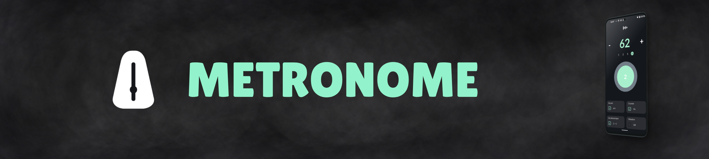
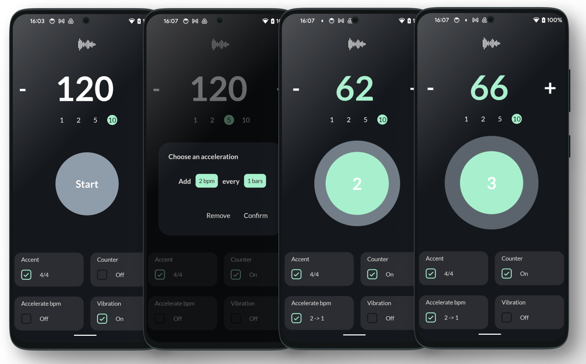

  

  A feature-rich, easy-to-use metronome app built to enhance your practice sessions with customization options.

  

## Table of Contents

- [Description](#description)
- [Features](#features)
- [How to Use](#how-to-use)
- [Feedback](#feedback)

## Description

Metronome is designed to be the perfect companion for musicians of all skill levels. It offers advanced functionality while remaining user-friendly. Whether you're practicing scales or preparing for a performance, Metronome will keep you in time with customizable beats, acceleration features, and visual aids.

## Features

Here are the key features that make my metronome app stand out:

* **Accent on First Beat:** Emphasize the first beat of each bar to help you stay on track. Choose between 4/4 and 3/4 meter settings.
* **Visible Counter:** Keep track of every beat with a clear, visual counter.
* **BPM Acceleration:** Gradually increase the tempo by a customizable BPM value over a specified number of bars.
* **Vibration Feedback:** Turn on vibrations for every beat for tactile feedback during practice.
* **Foreground Service:** The metronome runs as a foreground service, allowing easy control directly from the notification bar for seamless stopping.
* **Pulse Visualization:** A smooth visual pulse keeps you synced even when you can't rely on audio feedback alone.

  

## How to Use

1. **Select Your Meter**: Choose between 4/4 or 3/4 time signature to match your practice.
2. **Set the BPM**: Adjust the tempo to your desired beats per minute.
3. **Activate Acceleration (Optional)**: If you want to speed up over time, set the BPM increase and the number of bars before the tempo accelerates.
4. **Turn On Vibrations (Optional)**: Enable vibration mode for tactile feedback.
5. **Follow the Visual Pulse**: Use the pulse to maintain rhythm visually when audio feedback isn't enough.
6. **Manage from Notifications**: Start, stop, or control the metronome directly from your phone's notifications.

## Feedback

We’d love to hear your thoughts! Feel free to send me feedback, report bugs, or request new features.